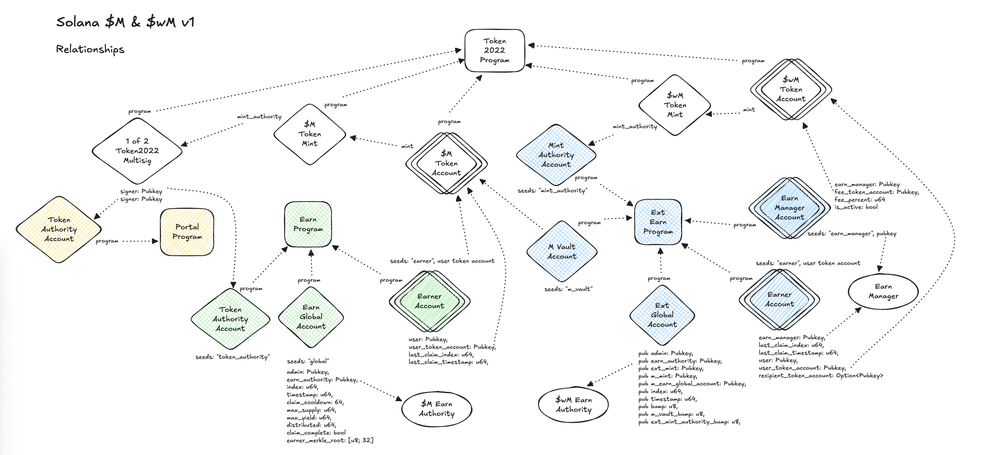

# Solana M

A Solana-based system for managing and distributing yield to token holders through multiple coordinated programs.

## Design

The purpose of the system is to allow bridging M to Solana and maintaining the yield earning features found on EVM chains.

An updated M index will be propagated to Solana whenever M is bridged. This bridge event starts a new claim cycle for yield if (a) one is not currently active, (b) the claim cooldown period has passed, and (c) if the index is larger than the one stored at the beginning of the most recent claim cycle.  We can use the timestamps of these index propagations to divide yield into chunks from the last update to the new one. The index is a multiplier that represents the increase in M tokens they would have if they held M from genesis. We can get the amount of M a user should have by multiplying their balance over the period by the new index and then dividing by the old index.

Yield is distributed in discrete batches and push manually by the "earn authority". Since user balances can change between claims, we will calculate weighted balances for the earner since the last time they claimed and use it to accurately distribute their yield once it reaches an amount worth sending (value > cost). Solana makes it fairly easy to get a list of token account balances for users offchain so we can use the RPC to collect this list when the index is propagated and have a permissioned address (aka “earn authority”) loop through them calling a “claim” function for each earner. The design for the off-chain portion still needs to be fleshed out.

In order to avoid this happening too often, a “cooldown” can be configured to limit how often the yield can be claimed. Additionally, the earn authority will need to “complete” the previous claim before a new one can be started.
Features
- Single, plain Token2022 representing $M
- Earn authority performs yield claim for users automatically for improved UX. A fairly simple offchain program will need to be written to perform these claims.
- Earn Managers are supported, but must be approved by TTG on mainnet
- The token will use a multisig mint authority configured as a 1 of 2 where the signers are:
    - Earn Program PDA
    - Portal Program PDA
- Merkle roots for the earner and earn_manager lists are propagated by cross-chain transfers after being constructed from values set on the TTGRegistrar contract on Ethereum mainnet

A key goal for the design was to limit the amount of Portal customization to only propagating custom messages from other chains. 



## Programs

### Earn
Handles yield distribution logic and earner management. Features include:
- Yield distribution cycles
- Earner registration
- Claim processing
- Earn manager configuration

Yield distribution is restricted to a permissioned `earn_authority`. The Portal starts a claim cycle by propagating the index and merkle root updates it receives from other chains and calling the Earn program initiate a claim cycle. The `earn_authority` calculates individual earner balances over the claim period and distributes using a crank-style mechanism. Yield doesn't have to be distributed for every user on each claim cycle since it is based on the last time they claimed. Once, the `earn_authority` has distributed all the yield for a claim cycle, it closes the cycle and waits for another index propagation. The frequency of the claims can be governed by the `claim_cooldown` period.

### Portal
The Portal is a fork of the Wormhole Native Token Transfer (NTT) program with a few modifications to suit our purposes:
- A custom `Payload` to be able to receive the M index as well as two merkle roots from other chains with each transfer.
- Utilitizing the newly added Token Multisig Mint Authority functionality to allow both the Portal and Earn programs to be able to mint M.
- Adding a couple accounts and a CPI call to the `Earn` program within the `ReleaseInboundMintMultisig` instruction to store the custom data sent in the `Payload`.

## Development Setup

### Prerequisites
- Rust and Cargo
- Node.js and Yarn
- Solana CLI tools (Solana 1.18.10)
- Anchor CLI (Anchor 0.29.0)

### Install Dependencies
```bash
yarn install
```

### Build Programs
```bash
anchor build
```

### Run Tests
```bash
anchor build && yarn test
```

### Development Commands
These commands are defined in `package.json` and `Anchor.toml`:

```bash
# Run linting
yarn lint

# Fix linting issues
yarn lint:fix
